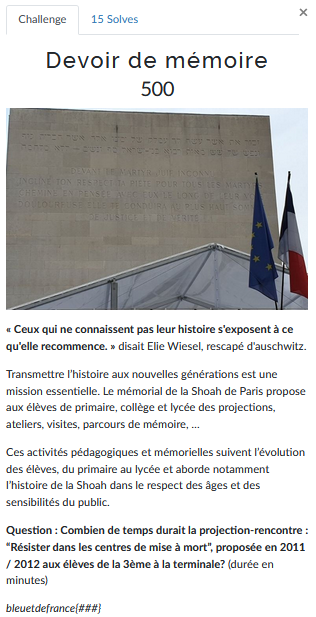

# Devoir de mémoire


Nous devons trouver la durée en minutes d'une projection qui avait lieu en 2011/2012 dans des classes de collèges/lycées.

C'est le challenge sur lequel j'ai le plus bloqué car je tournais en rond.
J'étais parti sur une mauvaise piste en cherchant un DVD lié au sujet "Résister dans les camps nazis" au lieu d'une "projection-rencontre".

Je vais vous épargner toutes les souffrances que j'ai vécu mais je vais quand même vous donner les pistes sur lesquelles j'étais parti au début.

En cherchant sur Google:
```
"résister dans les camps de mise à mort" rencontre 2011
```

On obtient plusieurs résultats qui peuvent nous faire penser que nous sommes sur la bonne piste:


On remarquera quand même qu'aucun résultat n'a été trouvé et donc on nous retourne ceux qui s'en rapprochent le plus. Et c'est ça qui m'a fait tourner en rond pendant plusieurs dizaines de minutes.

Finalement avec une recherche plus adaptée, on tombe sur un document qui nous fourni ce qu'on cherche:


C'est un PDF de 42 pages. Pour gagner du temps on va faire un *Ctrl-F*  dans le fichier en cherchant **"résister dans les centres "**:


On convertit la durée en minutes et on obtient notre flag.

---
### Flag
```
bleuetdefrance{210}
```