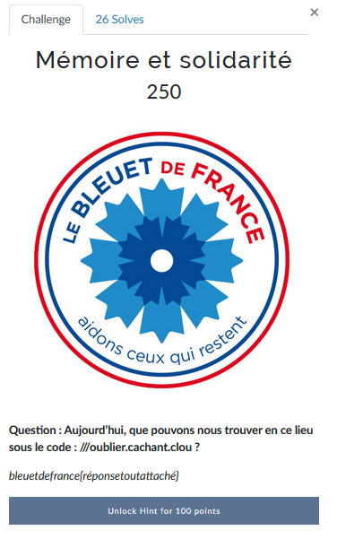
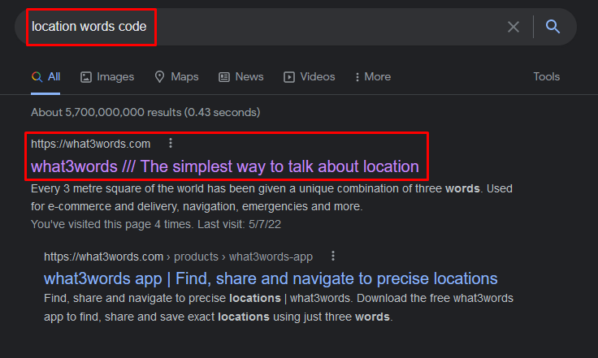
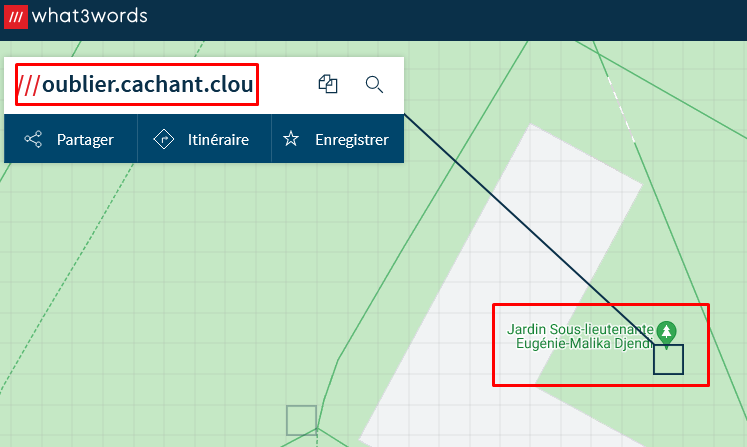
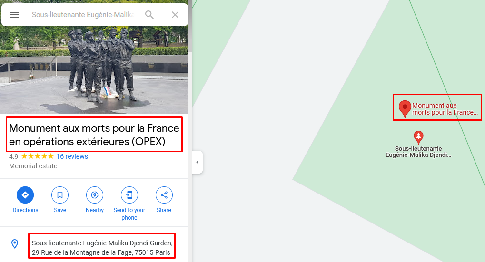

# Mémoire et solidarité


Nous devons trouver quelque chose (statue, bâtiment...) qui se situe à l'endroit indiqué par ce fameux code.

J'avoue que pour celui-ci je me suis basé sur mes connaissances pour reconnaître le format de ce "code". Il s'agit en fait de trois mots qui correspondent à un emplacement.

Une solution pour ceux qui ne connaissaient pas ce site était de faire une recherche Google dans ce style:


Pour trouver ce lieu il faut utiliser le site [https://what3words.com/](https://what3words.com/.md)



Nous nous situons à Paris, dans un jardin. Mais ceci est encore trop vaste et on n'a pas encore d'idée sur ce qui pourrait être à cet emplacement. On switch donc sur Google Maps et on se rend au même emplacement:


On trouve ce qu'on cherchait, on peut donc valider le challenge.

---
### Flag
```
bleuetdefrance{MonumentauxmortspourlaFranceenopérationsextérieures}
```