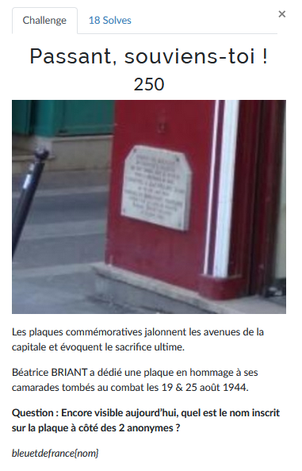
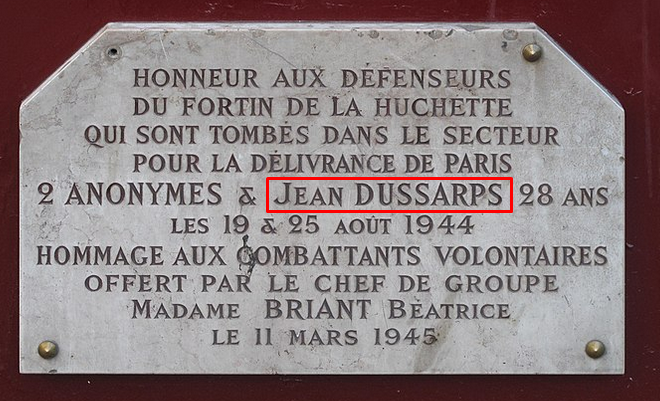

# Passant, souviens-toi !



L'objectif ici est de trouver le nom de la personne aux côtés des deux camarades anonymes tombés au combat dont  Béatrice BRIANT souhaite rendre hommage.

Comme nous avons fait les deux challenges précédents [Trip Advisor](Trip%20Advisor.md) et [Femme à la barricade](Femme%20%C3%A0%20la%20barricade.md) ça va grandement nous faciliter la tâche.

On sait désormais où se situe cette plaque (voir [Trip Advisor](Trip%20Advisor.md)).

Un zoom en utilisant Maps ne nous permet pas d'avoir un point de vue sur ce qui est écrit sur cette plaque. Il faut donc trouver un autre moyen.

En cherchant sur Google:
```
6 place du Petit-Pont paris
```

Et en descendant que quelques liens, on arrive sur le [Wikipédia](https://fr.wikipedia.org/wiki/Place_du_Petit-Pont) de la place, sur lequel on peut trouver une [photo](https://fr.wikipedia.org/wiki/Place_du_Petit-Pont#/media/Fichier:Plaque_Fortin_de_la_Huchette.jpg) de cette plaque commémorative:



Nous avons donc le nom de la personne qu'on recherche.

---
### Flag
```
bleuetdefrance{jeandussarps}
```