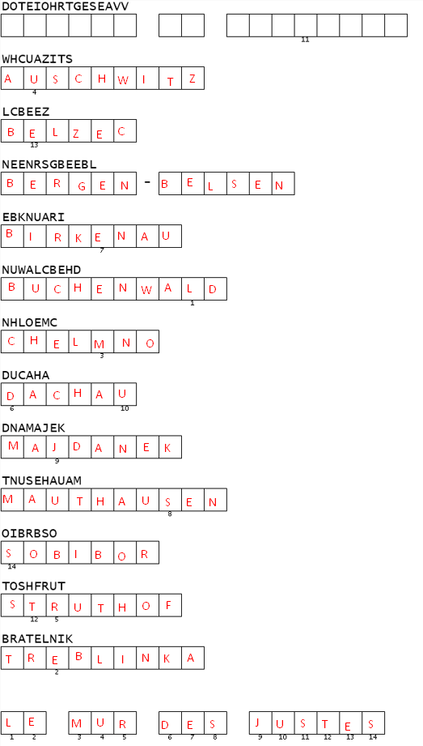

# Puzzle Mémoriel


Il s'agit ici d'une sorte de mots croisés dans lequel il faut remettre les lettres dans le bon ordre pour former des mots.

La partie la plus difficile est de trouver le thème de ces mots.

C'est le deuxième qui m'a mit la puce à l'oreille.

Il s'agit donc de camps de concentration et d'extermination. Je vous avoue que je n'ai pas réussi à trouver le premier. J'ai quand même pu deviner la dernière lettre. N'hésitez pas à me donner la solution sur mon Twitter ([@ZworKrowZ](https://twitter.com/ZworKrowZ)).



---
### Flag
```
bleuetdefrance{lemurdesjustes}
```