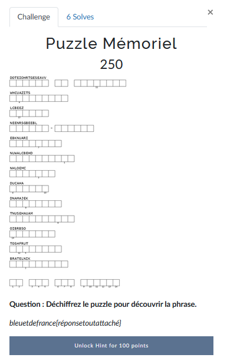

# Puzzle Mémoriel


Il s'agit ici d'une sorte de mots croisés dans lequel il faut remettre les lettres dans le bon ordre pour former des mots.

La partie la plus difficile est de trouver le thème de ces mots.

C'est le deuxième qui m'a mit la puce à l'oreille.

Il s'agit donc de camps de concentration et d'extermination. Je vous avoue que je n'ai pas réussi à trouver le premier. J'ai quand même pu deviner la dernière lettre.

Avec l'aide du hint on avait cette photo:


Avec quelques recherches on se rend compte qu'il s'agit d'un cylindre de bronze qui porte les noms des camps qu'on doit deviner et qui se situe dans le parvis à côté du mur des justes: [Le Parvis](https://www.memorialdelashoah.org/le-memorial/les-espaces-du-musee-memorial/le-parvis.html)


---
### Flag
```
bleuetdefrance{lemurdesjustes}
```
