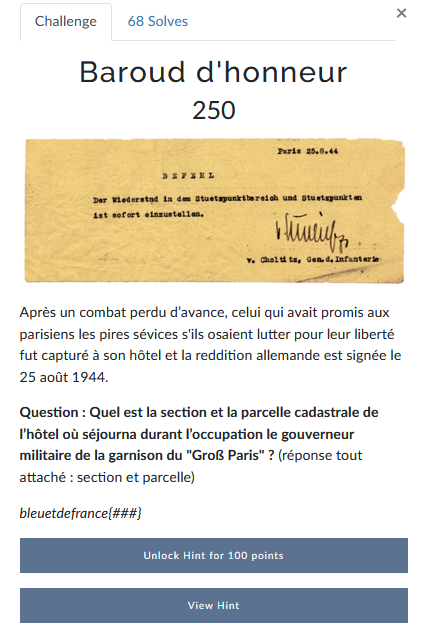
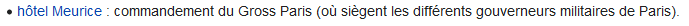
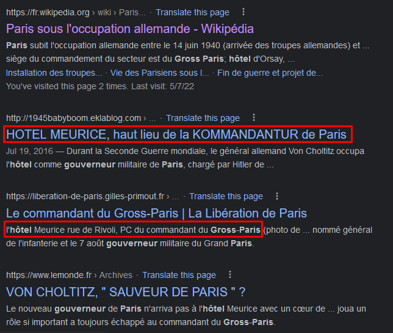
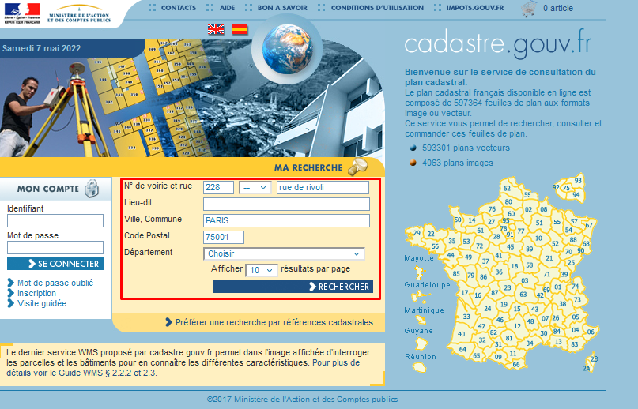
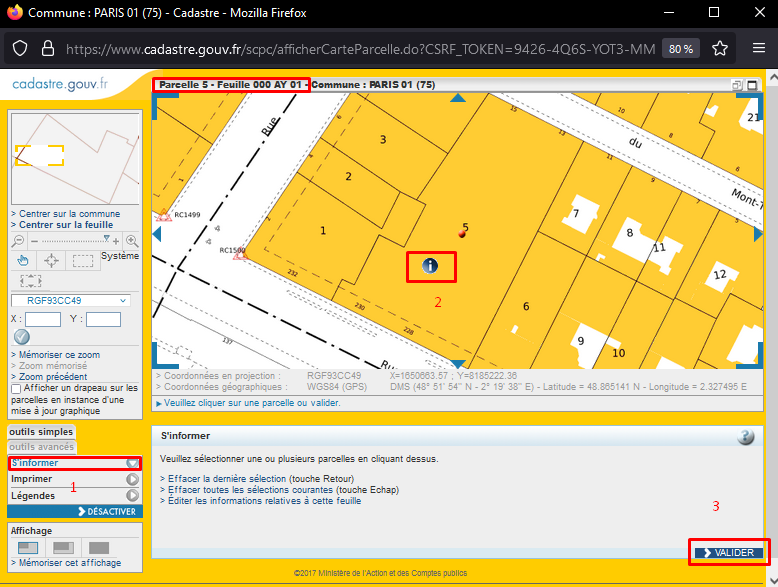
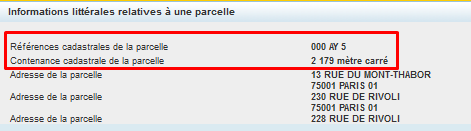
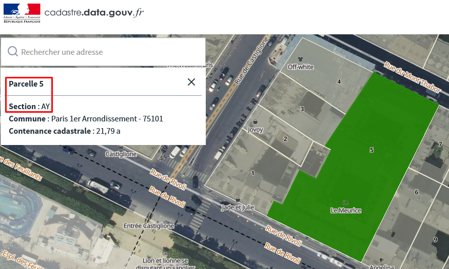

# Baroud d'honneur


La première étape est de comprendre ce qu'on doit chercher et trouver. Dans notre cas on veut une parcelle et une section. Ces informations peuvent être trouvées dans un cadastre comme indiqué dans la question.

Je vous laisse vous renseigner sur ce qu'est un cadastre si vous ne savez pas: https://fr.wikipedia.org/wiki/Cadastre

Pour ce challenge nous avons plusieurs mots clés à notre disposition pour nous aider dans nos recherches:
- **Hôtel**
- **Gouverneur**
- **Garnison du "Groß Paris"**

Il faut trouver où se situe l'hôtel pour ensuite accéder au registre cadastral et récupérer les informations qui nous intéressent.

Pour ce faire, on peut procéder de manière méthodique:
- On trouve l'identité de ce gouverneur de la garnison du "Groß Paris".
- On trouve où est-ce qu'il avait ses habitudes.
- On trouve la localisation de l'hôtel.

On commence par une recherche Google:
```
garnison du groß paris
```

Le premier lien nous renvoie vers [Wikipédia](https://fr.wikipedia.org/wiki/Paris_sous_l%27occupation_allemande). 
Avec une recherche dans la page sur "groß" on obtient le nom de l'hôtel: `hôtel Meurice`:


Il y a également plein d'autres façons de trouver le nom de l'hôtel. Un autre moyen est de chercher l'ensemble des mots clés:
```
hotel gouverneur groß paris
```

On tombe alors sur des liens mentionnant l'hôtel Meurice:


Il est possible de tomber aussi directement sur la page [Wikipédia](https://fr.wikipedia.org/wiki/Dietrich_von_Choltitz) liée à ce fameux général.
Au niveau de la section **Opérations** on apprend qu'il a pris ses quartiers à l'hôtel Meurice.
Dans le narratif, le général Dietrich Von Choltitz est présenté comme étant le "sauveur de paris" et aurait refusé d'exécuter les ordres d'Hitler qui lui aurait demander de faire sauter Paris.

On cherche alors l'adresse de ce fameux hôtel et on trouve: 
```
228 rue de Rivoli, 75001 Paris
```

Il ne nous reste plus qu'à récupérer le plan cadastral. Plusieurs sites proposent ce service gratuit. Personnellement j'ai utilisé le site officiel du gouvernement: https://www.cadastre.gouv.fr



Il nous suffit d'indiquer la rue ainsi que la ville pour qu'une nouvelle fenêtre s'ouvre avec les informations recherchées:



Dans l'encadré en haut on a directement le numéro de parcelle ainsi que la section. 

Mais on peut avoir plus d'informations en allant sur "S"informer" (1), on clique sur la parcelle qui nous intéresse (2), on valide (3).

La parcelle et la section sont toujours indiqués et on peut même voir la surface de la parcelle:


Un autre site officiel du gouvernement peut également nous permettre de résoudre ce challenge: [Cadastre France](https://cadastre.data.gouv.fr/map?style=ortho&parcelleId=75101000AY0005#18/48.865349/2.328214)




---
### Flag
```
bleuetdefrance{AY5}
```

---
### Ressources:
