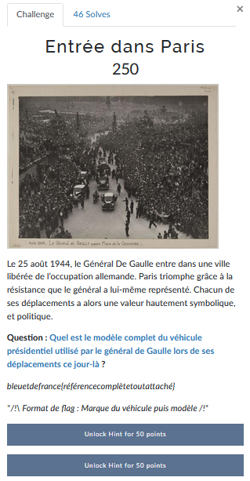
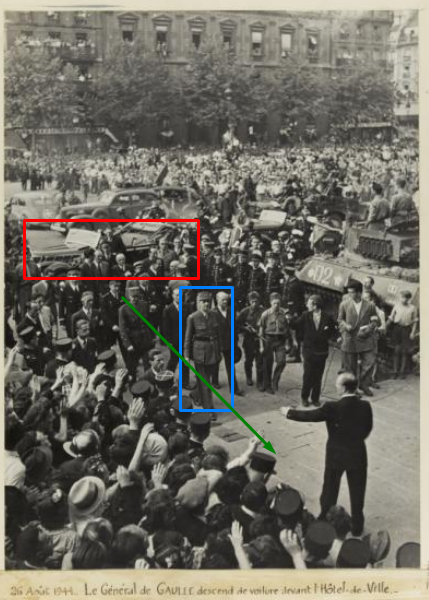
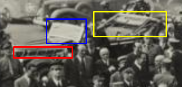
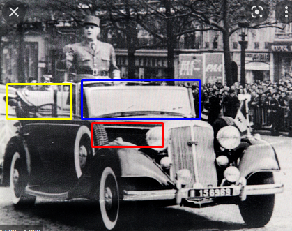
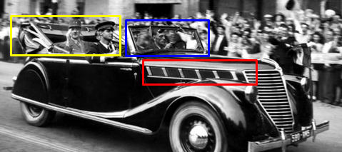
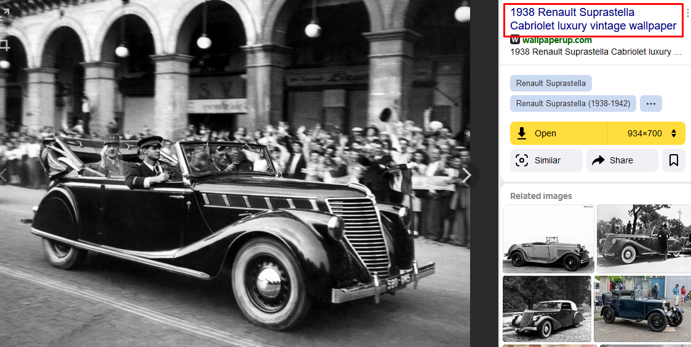

# Entrée dans Paris


Dans ce challenge il nous est demandé de trouver un modèle de véhicule utilisé par le Général De Gaulle  lors de ses déplacements le 25 août 1944.

La photo donnée ne nous permet pas d'obtenir assez d'informations sur le modèle de la voiture.

On va donc chercher sur Internet d'autres photos qui pourraient nous aider. Toujours avec notre ami Google:

```
de gaulle 1944 paris voiture
```

Le premier lien nous montre une photo sous un autre angle (https://www.parismuseescollections.paris.fr/fr/musee-carnavalet/oeuvres/liberation-de-paris-26-aout-1944-le-general-de-gaulle-descend-de-voiture):



De Gaulle (bleu) descend de sa voiture (rouge) et avance en direction de l'hotel de ville (vert).
La direction nous donne l'indication que la voiture (rouge) est bien celle depuis laquelle il est sorti.

A ce stade il ne nous est toujours pas possible de voir la marque du véhicule (sauf si vous êtes assez cultivé pour la reconnaître). On peut cependant remarquer des détails intéressants:



En rouge on voit des sortes d'aérations qui vont nous permettre de dire si une voiture semblable les a également.
On remarque aussi que la voiture est décapotable (jaune). On peut aussi noter la forme du pare-brise qui est légèrement vouté (bleu).

Le Général De Gaulle possédait plusieurs voitures. Ces détails vont nous permettre de valider que c'était bien elle qui était utilisée pour ce jour.

Si on continue nos recherches dans Google Image on peut voir une première voiture qui est la Horch 830:



Cependant on ne retrouve pas tous les détails identifiés auparavant. Notamment au niveau du capot (rouge).

Une autre photo a attiré mon attention:



Sur celle-ci on reconnait les détails identiques à la première photo. On va donc essayer de trouver la marque et le modèle du véhicule.

Pour se faire on peut utiliser Yandex pour faire une recherche inversée sur l'image. On obtient ceci:



Nous avons donc trouvé le véhicule !

---
### Flag
```
bleuetdefrance{renaultsuprastella}
```