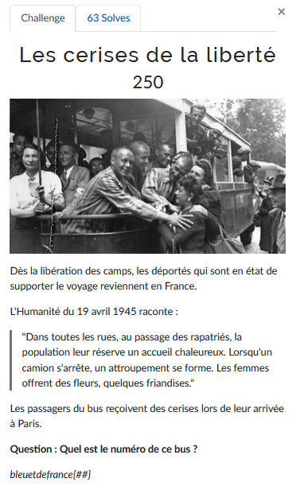
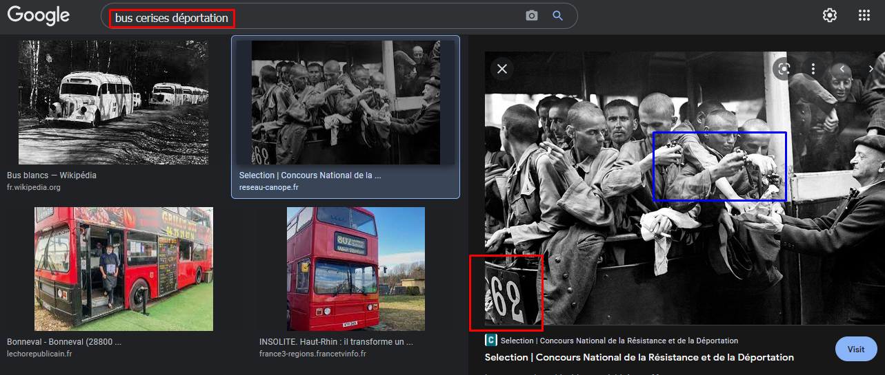

# Les cerises de la liberté


Nous devons trouver le numéro du bus dans lequel les déportés libérés recoivent des cerises.

Encore une fois, avec une bonne requête via Google il nous est possible de trouver directement la réponse:



On voit bien que des cerises sont distribuées (bleu) et que le numéro du bus est 62 (rouge).

---
### Flag
```
bleuetdefrance{62}
```