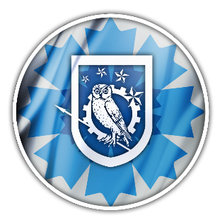

# BleuetCTF

- Lien du CTF: https://bleuet.aege.fr/
- Organisé par: https://twitter.com/Steven_DFS et https://www.aege.fr/groupe/club-osint-veille-18
- Pour faire un don au Bleuet de France: https://www.onac-vg.fr/dons/

- Mon [Twitter @ZworKrowZ](https://twitter.com/ZworKrowZ)

Un grand merci à [@Steven_DFS](https://twitter.com/Steven_DFS) qui m'a aidé à corriger et améliorer ces writeups :)

---
### Classement

Je suis content d'avoir pu terminer 2ème de ce CTF puisque c'était mon premier CTF orienté OSINT.
Un gros gg à tous les participants et aux organisateurs !

Suite ça cette 2ème place au CTF, un badge m'a été délivré par l'organisation:
https://eu.badgr.com/public/assertions/Iym3Z9A9TCyH3yoCQTfukg

---
### Vue d'ensemble des challenges

