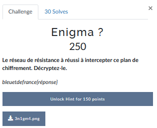
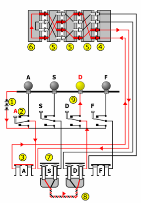
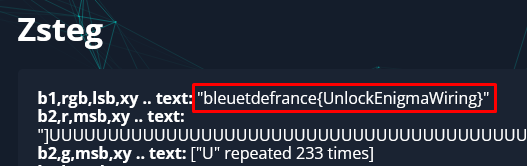

# Enigma ?


Pour ce challenge, l'image suivante nous était donnée:



J'ai mis un peu de temps à comprendre ce qu'il fallait faire. 
J'ai compris qu'il s'agissait d'un diagramme simplifié de la machine Enigma qui permettait le chiffrement des communications mais je ne savais pas où chercher le fameux message à "décrypter".

Sur cette image et via le [Wikipédia](https://fr.wikipedia.org/wiki/Enigma_(machine)#Description) on comprend bien qu'ici la touche "A" est bind avec le "D" et inversement. Mais ça ne nous aide en rien à déchiffrer un quelconque message.

J'ai donc essayé de regarder du côté de la stéganographie. Peut-être qu'un message était caché dans l'image.

Pour ce faire j'ai utilisé le très connu outil [Apérisolve](https://aperisolve.fr/).

Premièrement je me suis attardé sur ce qui ressortait au niveau des couleurs car il semblait qu'en haut de l'image apparaissait un code morse. Cependant il était à chaque fois différent entre le Rouge/Bleu/Vert et ça ne donnait rien de probant:


J'ai donc continué et au niveau de `zsteg` le flag est apparu:


Ce challenge était également réalisable en local directement avec l'outil `zsteg`. C'est un outil qui permet de détecter si de la donnée est stockée dans des images via différentes techniques (LSB, compression...).

---
### Flag
```
bleuetdefrance{UnlockEnigmaWiring}
```