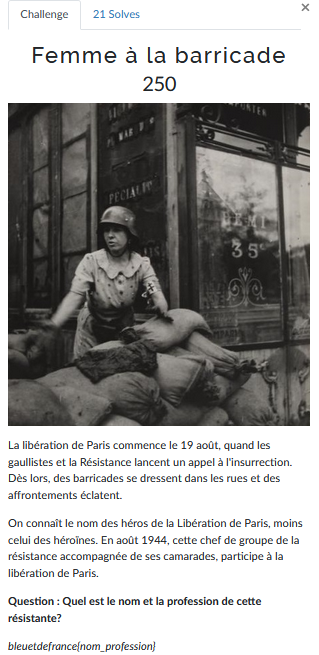

# Femme à la barricade


L'objectif est de retrouver le nom de cette femme ainsi que sa profession durant la deuxième guerre mondiale.

Ce challenge m'a fait perdre pas mal de cheveux puisque les différentes sources ne donnaient pas toutes les mêmes informations.

Un commence avec une recherche inversée sur la photo via [Yandex](https://yandex.com/images/):


On se retrouve sur un site Russe (puisque Yandex), on descend jusqu'à arriver à la photo qui nous intéresse et on observe le texte suivant:


Après traduction en français et anglais on obtient le texte suivant:

A savoir que le nom qui ressort est le même pour les deux langues (anglais/français).
On a désormais un nom qui ressort. Sauf qu'une recherche sur Google via se nom ne ressort aucun résultat qui ressemble de près ou de loin à ce qu'on cherche.

On tente alors une autre approche:


Cette requête nous donne beaucoup plus d'informations qui peuvent nous permettent de continuer nos recherches.
On a désormais le nom d'une rue et on connait son métier: **Boulangère**.

On va utiliser l'information de la rue pour essayer de trouver des résultats plus précis:


Bingo, on a enfin le nom de la femme qu'on recherche et en plus on a confirmation qu'elle est bien boulangère.

Sauf que le flag ne passe toujours pas...

Après ~~quelques~~ **BEAUCOUP** de recherches et de désespoir j'ai eu l'idée d'essayer le nom de cette femme sous une autre orthographe: 


Étonnamment ça fonctionne beaucoup mieux quand on a le bon nom de la personne.

Le flag se valide donc avec cette orthographe.

La leçon a retenir de ce challenge c'est qu'il ne faut jamais faire confiance à l'orthographe des noms qu'on recherche, et qu'un tout petit changement peut donner un résultat otalement différent.

---
### Flag
```
bleuetdefrance{briant_boulangere}
```