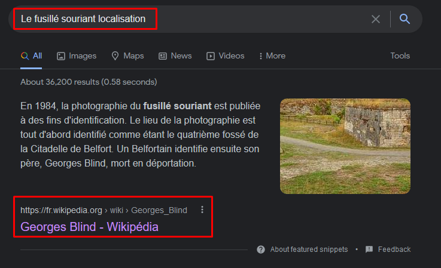

# Le fusillé souriant


Il faut retrouver les coordonnées exactes du lieu où le "fussilé souriant" a été exécuté.

Dû au format du flag, on se doute que l'information doit être donnée directement sous forme de coordonnées GPS et que ce n'est pas à nous d'aller sur maps pour essayer de la trouver (c'est toujours possible mais faudrait un sacré coup de chance).

La recherche suivante nous ammène directement sur Wikipédia et nous donne le nom de cette personne:



Une fois sur la page Wikipédia, en cliquant sur la photographie, on voit en bas à droite les coordonnées exactes du lieu:


---
### Flag
```
bleuetdefrance{47°38′3,35″N,6°51′55,37″E}
```