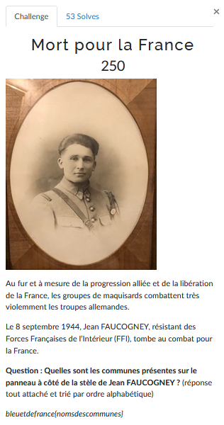
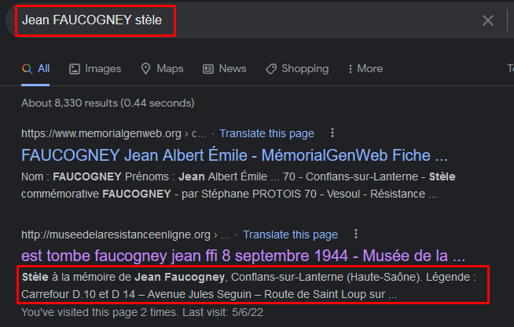
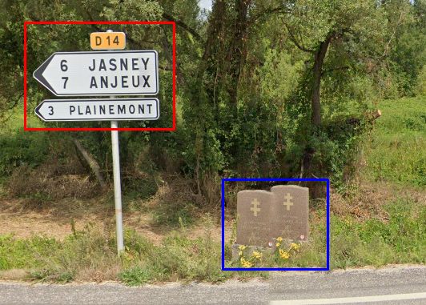

# Mort pour la France


Pour connaitre le noms des villes sur le panneau à côté de la stèle, il faut d'abord trouver cette stèle.

Avec une recherche Google on a déjà des résultats qui peuvent nous ammener sur une piste:


On connait le nom de la ville/village ainsi que son emplacement de manière grossière: dans un carrefour entre la départementale D.10 et D40.

On va d'abord faire un repérage avec **Google Maps**:


L'emplacement semble correspondre aux données précédentes.

On va donc se rendre toujours avec Maps sur le carrefour:



[Lien Maps](https://www.google.com/maps/@47.8320703,6.2162915,3a,54.2y,341.53h,82.28t/data=!3m6!1e1!3m4!1swRqj26fwBS8AbaZjYP8hRg!2e0!7i16384!8i8192)

Même si l'image est floue, en zoomant on peut vérifier qu'il s'agit bien d'une stèle en hommage à Jean FAUCOGNEY (bleu).
On a également les trois villes (rouge) à remettre dans l'ordre alphabétique pour obtenir notre flag.

---
### Flag
```
bleuetdefrance{anjeuxjasneyplainemont}
```