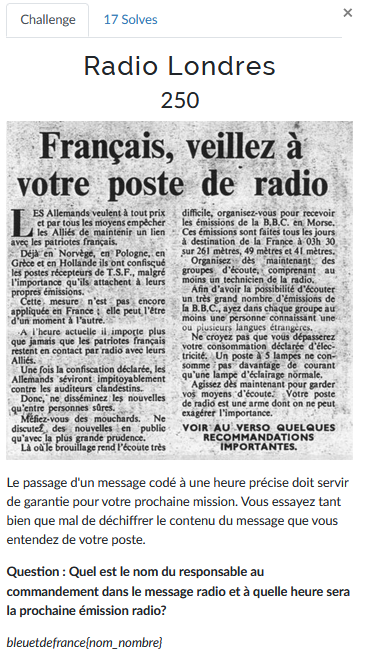
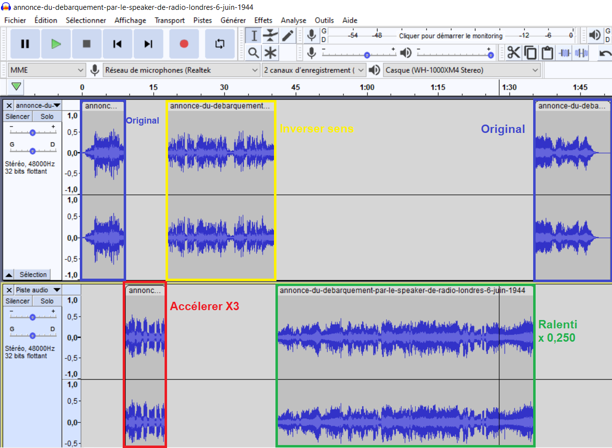
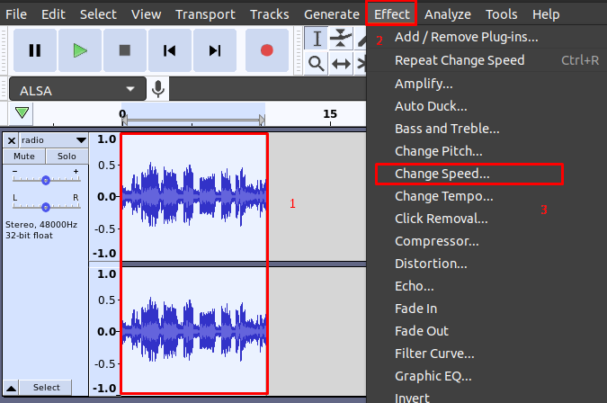
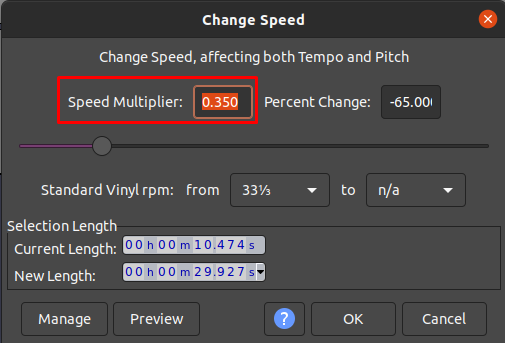
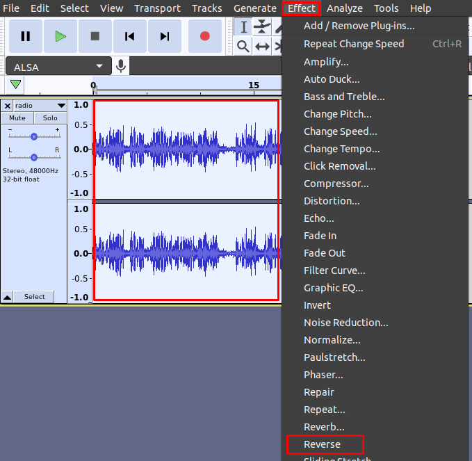
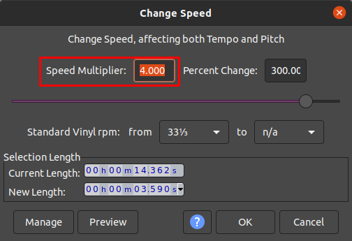

# Radio Londres


Un fichier audio nous est transmis et on doit trouver à l'intérieur le nom du responsable au commandement ainsi que l'horaire de la prochaine émission radio.

Ce challenge est celui qui a nécessité le plus de bidouilles au niveau d'un logiciel audio.

Pour ma part j'ai utilisé [Audacity](https://www.audacityteam.org/) qui est gratuit et facile d'utilisation.

On charge le fichier dans Audacity, on regarde les deux pistes audio et on écoute une fois entièrement la fichier pour voir si on ne peut pas déjà détecter quelque chose d'audible. Les deux pistes sont identiques.

Suite à cette écoute on peut identifier trois portions qui peuvent être intéressantes:



- La première partie (rouge) semble accélérée.
- La deuxième partie (vert) semble inversée.
- La dernière partie (jaune) semble ralentie.

On va donc prendre les parties une à une et faire les modifications nécessaires pour les rendre audibles.

---
### Première partie
Cette partie semble accélérée, on va donc la ralentir:


On sélectionne d'abord notre piste (1), on se rend dans le menu "Effet" (2) et on change la vitesse (3)

Après plusieurs essais, j'ai trouvé la vitesse qui correspondait le mieux pour entendre correctement l'audio:



Malheureusement cette portion d'enregistrement ne nous donne aucune indication sur ce qu'on cherche.

---
### Deuxième partie
L'audio ressemble à des invocations chamaniques donc il faut très certainement reverse la piste.
On procède de la même manière que pour l'autre piste mais cette fois-ci au niveau des effets on choisit "Reverse":



On entend alors distinctement à un moment donné: "Sous le commandement du général Eisenhower...".

On a trouvé une partie du flag.

---
### Troisième partie
Pour cette dernière partie on reprend exactement le même principe que pour la première mais on va accélérer la piste audio. Après quelques tests voici le réglage que j'ai trouvé:



A la toute fin on entend alors que la prochaine émission sera diffusée à 17 heures.

---
### Flag
```
bleuetdefrance{Eisenhower_17}
```
