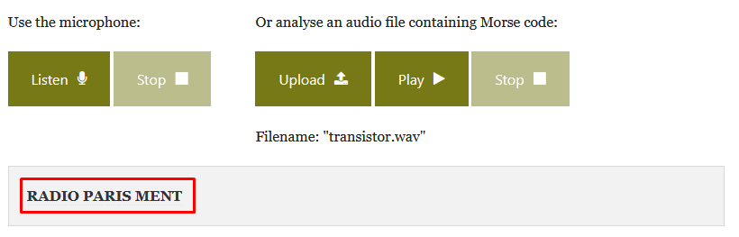

# Titi-tata


On doit trouver le message caché dans le fichier audio qui nous est fourni.

Rien qu'à la première écoute, on reconnaît le code morse et son son aussi familier.

On a alors plus qu'à le décoder. A chaque fois qu'il y a du code morse audio à décoder j'utilise ce site: [Morse code World](https://morsecode.world/international/decoder/audio-decoder-adaptive.html).
Il suffit de lui passer le fichier audio et il s'occupe du reste:


---
### Flag
```
bleuetdefrance{RADIOPARISMENT}
```