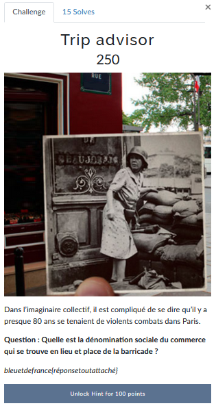
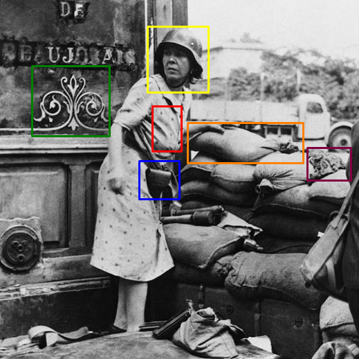
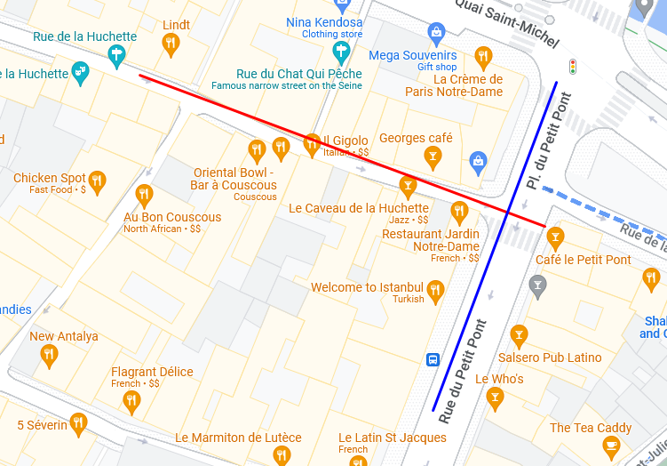
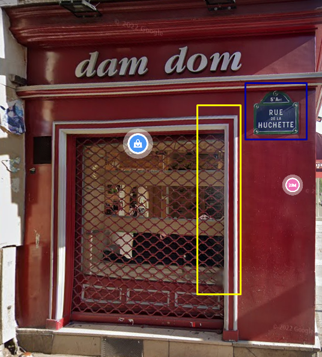
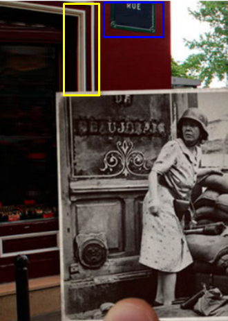
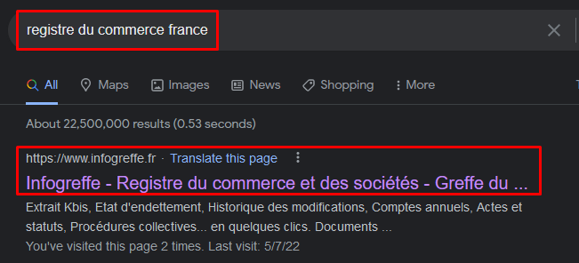
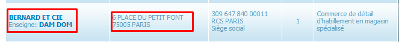

# Trip Advisor


Nous devons trouver la **raison sociale** ou **dénomination sociale** du commerce qui se trouve actuellement à l'endroit où a été prise la photo.

Attention la raison sociale d'une entreprise peut être différente du nom affiché sur l'entreprise/commerce.

Les recherches précédentes sur le challenge [Femme à la barricade](Femme%20%C3%A0%20la%20barricade.md) nous a permis de voir que nous étions déjà tombés sur la même photo. Nous savons donc qu'il s'agit de la même femme. On peut quand même faire une rapide vérification pour être sûr et ne pas perdre trop de temps ensuite s'il s'agissait finalement d'une autre personne.

Voici la photo qu'on avait pour le challenge [Femme à la barricade](Femme%20%C3%A0%20la%20barricade.md):


Et voici la nouvelle photo (celle-ci a été récupérée via Yandex pendant le challenge [Femme à la barricade](Femme%20%C3%A0%20la%20barricade.md) mais on aurait pu très bien se baser sur celle donnée dans l'énoncé):



Même si de visuel on voyait bien que c'était la même personne et le même lieu entre les deux photos, j'ai fait exprès de forcer sur les preuves pour montrer comment on peut identifier des éléments qui nous permettent ensuite de comparer des photos et vérifier qu'elles snot liées.

On y retrouve bien la sacoche (bleu), le sigle sur le magasin (vert), la disposition du sac (orange), le chiffon/vêtement (violet), la robe à pois (rouge) et le même casque (jaune).

On est sûr que c'est la même personne donc on peut réutiliser les éléments qu'on avait trouvé dans le challenge précédent.

On connaît la rue et la ville, il nous suffit de nous y rendre:
- Rue de la Huchette
- Paris
- Angle de la place du Petit-Pont



On s'y rend à pied avec Street Maps:



[Lien Maps](https://www.google.com/maps/@48.8528,2.346508,3a,75y,26.39h,92.81t/data=!3m6!1e1!3m4!1su0XF3eZ2gVg5G8H2aJ4NWw!2e0!7i16384!8i8192)

Ce lieu correspond bien avec l'image de l'énoncé:



On a également le nom du commerce: **Dam Dom**

Il ne nous reste plus qu'à aller chercher la raison sociale de ce commerce dans le registre du commerce:





Ce commerce semble correspondre à ce qu'on cherche.

---
### Flag
```
bleuetdefrance{bernardetcie}
```
